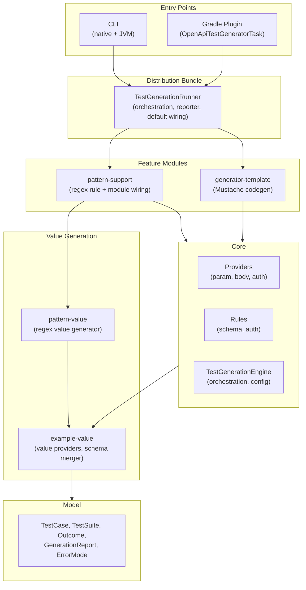
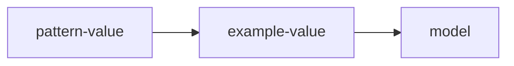

# Architecture

## System Overview

OpenAPI Test Generator is a Kotlin/JVM toolchain that turns OpenAPI specs into executable tests or test-suite artifacts. It targets:

- CLI users who want a fast generator for local runs or CI
- Gradle users who want generation wired into build pipelines
- Integrators who embed the core engine to customize rules, data providers, or generators

The design centers on a small, deterministic core that owns parsing, rule application, and test-suite assembly, with optional feature modules (template
generation, pattern-based values) injected explicitly by CLI/Gradle to avoid reflection-based discovery.

## What This Tool Tests

OpenAPI Test Generator validates **infrastructure-level behavior** - the contract compliance layer between API consumers and your controllers. This is distinct from business logic testing.

### Infrastructure validation (what we test)

- **Parameter validation**: Type checking, format constraints (date, email, uuid), min/max bounds, enum membership, required vs optional
- **Request body validation**: JSON schema compliance, nested object structure, array limits, property constraints
- **Security enforcement**: Authentication presence, valid credentials format, correct security scheme usage

### Business logic (what we don't test)

- Data semantics (e.g., "order total must equal sum of line items")
- Authorization rules beyond API-level security (e.g., "users can only access their own orders")
- Side effects (e.g., "creating an order should send a confirmation email")
- State transitions (e.g., "orders can only be cancelled before shipping")

The generated tests verify that your API **rejects invalid requests** with appropriate error codes (400, 401, 403) - they don't verify what happens when valid requests are processed.

## Related docs
- Documentation index: [docs home](../index.md)
- Getting started: [Getting started](../getting-started/index.md)
- How-to guides: [How-to](../how-to/index.md)
- Development: [development setup](../contributing/development-setup.md)
- Core module: [core](../modules/core.md)
- Reference:
  - [Distribution settings](../reference/distribution-settings.md)
  - [Rules catalog](../reference/catalogs/rules-catalog.md)
  - [Providers catalog](../reference/catalogs/providers-catalog.md)
  - [API reference](../reference/api.md)

## Module Dependency Graph

### Layered Architecture



### Value Provider Dependency Chain

The value generation stack follows a strict dependency direction:



**pattern-value** contains:

- `PatternValueProvider` (implements SchemaValueProvider SPI)
- `PatternValueGenerator` (regexp-gen wrapper)
- No core dependency

**example-value** contains:

- `SchemaValueProvider` SPI interface
- Built-in providers (enum, date, uuid, etc.)
- `SchemaMerger`, `CartesianProduct`

This layering enables standalone use of `pattern-value` for regex-based string generation without pulling in the test generation framework.

### Module Responsibilities

| Module                  | Responsibility                         | Key Types                                                                   |
|-------------------------|----------------------------------------|-----------------------------------------------------------------------------|
| **model**               | Data classes, error types              | `TestCase`, `TestSuite`, `Outcome`, `GenerationError`                       |
| **example-value**       | Schema value generation SPI + builtins | `SchemaValueProvider`, `SchemaExampleValueGenerator`, `SchemaMerger`        |
| **core**                | Parsing, generation, orchestration     | `TestGenerationEngine`, providers, rules, `TestSuiteWriter`                 |
| **pattern-value**       | Regex-based value generation           | `PatternGenerationOptions`, `PatternValueGenerator`, `PatternValueProvider` |
| **pattern-support**     | Pattern integration module             | `PatternSupportModule`, `PatternModuleSettingsExtractor`                    |
| **generator-template**  | Mustache-based code generation         | `TemplateGeneratorModule`, `TemplateArtifactGenerator`                      |
| **distribution-bundle** | Bundles modules, execution wiring      | `TestGenerationRunner`, `TestGenerationReporter`, `DistributionDefaults`    |
| **plugin**              | Gradle build integration               | `OpenApiTestGeneratorPlugin`, `OpenApiTestGeneratorTask`                    |
| **cli**                 | Command-line interface + native        | `GenerateCommand`, Picocli wiring                                           |

## Data Flow

1. **Entry point**: CLI or Gradle creates a `TestGenerationRunner` (via `withDefaults()` or builder) with an environment-specific `TestGenerationReporter`.
2. **Configuration resolution**: `TestGenerationRunner.execute()` calls `TestGeneratorExecutionOptionsFactory.fromConfig` to merge overrides over YAML config
   and
   apply defaults.
3. **Parse OpenAPI**: `OpenApiSpecParser.parseOpenApi` loads and resolves the OpenAPI document with `ParseOptions().apply { isResolveFully = true }`.
4. **Build generation pipeline**: `TestGenerationEngine.createProcessor` wires schema merging, value providers, rules, and providers via
   `TestGeneratorConfigurer`.
5. **Generate suites per operation**:
    - `ValidCaseBuilder` constructs a baseline valid test case from operation parameters, request body, and security requirements.
    - `TestGenerationContext` wraps the valid case, OpenAPI model, and helper services (data providers, schema merger).
    - `ProviderOrchestrator` executes providers in fixed order (auth -> parameters -> request body).
    - Each provider applies rules to generate negative test cases expecting 400/401/403 status codes.
    - `OutcomeAggregator` collects provider results, merging test cases and errors.
    - `TestCaseBudgetValidator` enforces per-operation limits on generated test cases.
6. **Report outcomes**: `GenerationReport` captures successes, partials, and failures with `GenerationError` metadata. `TestGenerationRunner` formats and logs
   the report via its reporter.
7. **Emit artifacts**: `TestGenerationEngine.createArtifactGenerator` builds a generator by id (`test-suite-writer` or `template`) and writes files.
8. **Return result**: `TestGenerationRunner` returns `TestGenerationResult.Success` or `TestGenerationResult.Failure` for CLI/Gradle to handle appropriately.

## Core Abstractions

### Provider-Rule Architecture Pattern

- **Providers** implement `TestCaseProvider<T>` and operate on OpenAPI elements (operations,
  parameters, request bodies). They are orchestrated in a fixed order by `ProviderOrchestrator`.
- **Rules** encode constraints:
    - `SchemaValidationRule` produces `RuleValue` entries that providers turn into test cases.
    - `AuthValidationRule` produces complete `TestCase` objects for security scenarios.
- **Composition** for array/object schemas is handled through `ArrayItemSchemaValidationRule` and `ObjectItemSchemaValidationRule` using a `RuleContainer`.
- **Registry**: `ManualRuleRegistry` wires `BuiltInRules` plus any extra rules, ensuring deterministic ordering.

### Generator Extensibility Model

- **Artifact generators** are created through `ArtifactGeneratorFactory` and `ArtifactGeneratorRegistry` using generator ids (`GeneratorIds`).
- **Built-in** generators are registered explicitly by `BuiltInGenerators` (currently `test-suite-writer`).
- **Feature modules** implement `TestGenerationModule` to contribute:
    - `ArtifactGeneratorFactory` implementations
    - `SchemaValueProvider` instances (by id)
    - Additional `SimpleSchemaValidationRule` and `AuthValidationRule` rules
- CLI and Gradle pass modules explicitly (e.g., `TemplateGeneratorModule`, `PatternSupportModule`) to enable optional capabilities.

### Configuration Resolution Chain

- **Inputs**:
    - YAML config (`GeneratorConfig`) loaded by `GeneratorConfigLoader`.
    - Environment overrides from CLI args or Gradle DSL (`TestGeneratorOverrides`).
- **Merge**:
    - `TestGeneratorExecutionOptionsFactory` merges overrides over config (overrides win).
    - Module-specific settings are extracted via `ModuleSettingsExtractor` before core settings parsing.
    - `TestGenerationSettings` and `ExampleValueSettings` supply defaults when values are missing.
- **Defaults**:
    - CLI and Gradle insert the `pattern` example-value provider into the default provider order before `plain-string`.
- **Note**: The merge is deep for nested maps in `generatorOptions` and `testGenerationSettings`. Collections are replaced (not merged), and map/non-map
  mismatches prefer the override value (no fail-fast).

### Test Suite Generation Pipeline

#### ValidCaseBuilder

Constructs the baseline valid `TestCase` for each operation:

- Resolves required parameters (path, query, header, cookie) and populates with example values.
- Handles request body with the first supported media type (JSON preferred).
- Applies security requirements via `SecurityValueProvider` using configured `validSecurityValues`.
- Uses `SchemaExampleValueGenerator` to derive values from schema examples, defaults, or basic types.

#### TestGenerationContext

Interface providing shared context during test case generation:

```kotlin
public interface TestGenerationContext {
    val openAPI: OpenAPI                      // Parsed spec
    val operation: Operation                   // Current operation
    val validCase: TestCase                    // Baseline valid case
    val basicTestData: BasicTestDataProvider   // Basic test values
    val securityValueProvider: SecurityValueProvider
    val schemaExampleValueGenerator: SchemaExampleValueGenerator
    val schemaMerger: SchemaMerger             // Handles allOf/anyOf/oneOf
    val maxDepth: Int                          // Schema traversal limit
    val combinationBudget: CombinationBudget?  // Schema explosion control
    val visitedSchemaRefs: Set<String>         // Cycle detection for $ref
    val depth: Int                             // Current traversal depth
    val schemaPath: List<String>               // Property/item path

    fun checkSkip(schema: Schema<*>): SkipReason?
    fun withVisitedSchema(schema: Schema<*>, name: String): TestGenerationContext?
}
```

`DefaultTestGenerationContext` is the standard implementation used by `DefaultTestSuiteGenerator`.

#### Provider Execution Order

`ProviderOrchestrator` executes providers sequentially in fixed order:

1. **AuthTestCaseProviderForOperation**: Generates negative cases for security scheme violations.
2. **ParameterTestCaseProviderForOperation**: Generates negative cases for path, query, header, and cookie parameters.
3. **RequestBodyTestCaseProviderForOperation**: Generates negative cases for request body validation.

Each provider returns `Outcome<List<TestCase>>` and is wrapped by `runProviderSafely` to convert exceptions to `Outcome.Failure`.

#### Budget Controls

Hard limits prevent runaway generation from complex schemas:

- **CombinationBudget**: Limits schema combinations during allOf/anyOf/oneOf expansion. Throws `BudgetExceededException` when exceeded.
- **TestCaseBudgetValidator**: Enforces `maxTestCasesPerOperation` limit by throwing `BudgetExceededException`.
- **maxSchemaDepth**: Prevents infinite recursion in nested/recursive schemas.
- **maxSchemaCombinations**: Controls explosion from composed schemas.

Budget violations inside providers are captured as `GenerationError` with meaningful context (operation path, method, limit type).
`TestCaseBudgetValidator` exceptions propagate unless the caller catches them.

### Schema Processing

#### SchemaMerger

Handles OpenAPI schema composition (allOf, anyOf, oneOf):

- Flattens composed schemas into a single merged schema for validation.
- Preserves constraint semantics (e.g., tightest bounds win for min/max).
- Tracks recursion depth via `SchemaMergerOptions.maxMergedSchemaDepth`.
- Works with `CombinationBudget` to limit cartesian explosion.

#### Cycle Detection

- `SchemaStructureHasher` computes structural hashes to detect schema cycles.
- `TestGenerationContext` implementations track `visitedSchemaRefs` and `visitedStructures` to prevent infinite loops.
- Cycle detection is deterministic and does not rely on object identity.

### Example Value Generation

Providers are tried in configured order until one produces a value:

1. **schema-example**: Uses OpenAPI `example` or `examples` from the schema.
2. **pattern** (pattern-support module): Generates values matching regex patterns.
3. **plain-string**: Falls back to basic type-appropriate values.

`ExampleValueSettings.providers` controls the order. `SchemaExampleValueGeneratorFactory` wires the configured providers into a `SchemaExampleValueGenerator`.

## Module Deep-Dives

### model

- Responsibility: Canonical data models for test cases, suites, and generation errors.
- Public API surface: `TestCase`, `TestSuite`, `SecurityValues`, `KeyValuePair`, `Outcome`, `GenerationReport`, `GenerationError`, `ErrorHandlingConfig`,
  `ErrorMode`, `ErrorContext`, `BudgetExceededException`.
- Key types and roles: `TestCase` and `TestSuite` are the primary payloads; `Outcome` and `GenerationReport` encode success/error semantics.
- Extension points: None (data-only module).
- Docs: [model module](../modules/model.md), [model reference](../reference/model/test-suite.md), [errors](../reference/model/errors.md).

### example-value

- Responsibility: Standalone schema value generation library with SPI for custom providers. No `core` dependency.
- Public API surface:
    - SPI: `SchemaValueProvider` interface for custom value generators.
    - Generator: `SchemaExampleValueGenerator`, `SchemaExampleValueGeneratorFactory`, `SchemaExampleValueGeneratorOptions`.
    - Configuration: `ExampleValueSettings`, `ConfigurationException`.
    - Schema utilities: `SchemaMerger`, `SchemaTypeHelpers`.
    - Budget controls: `CombinationBudget`, `CartesianProduct`.
- Key types and roles:
    - `SchemaValueProvider`: SPI interface that `pattern-value` and built-in providers implement.
    - `SchemaExampleValueGenerator`: Orchestrates a provider chain to generate example values from schemas.
    - `SchemaMerger`: Flattens allOf/anyOf/oneOf compositions into unified schemas.
    - Built-in providers: `EnumValueProvider`, `DateValueProvider`, `DateTimeValueProvider`, `UuidValueProvider`,
      `EmailValueProvider`, `PlainStringValueProvider`, `NumberValueProvider`, `BooleanValueProvider`,
      `ConstValueProvider`.
- Internal packages:
    - `spi/`: `SchemaValueProvider` interface.
    - `generator/`: Example value generation orchestration.
    - `providers/`: Built-in provider implementations.
    - `openapi/`: Schema helpers and merger.
    - `config/`: Settings and configuration extraction.
    - `util/`: Shared utilities (cartesian product, budget, format constants).
- Extension points:
    - Implement `SchemaValueProvider` to add custom value generators (e.g., `PatternValueProvider`).
    - Register providers by id in `ExampleValueSettings.providers`.
- Docs: [example-value module](../modules/example-value.md).

### core

- Responsibility: Parse OpenAPI, generate suites, apply rules, and orchestrate artifact generation.
- Public API surface:
    - Configuration: `TestGenerationEngine`, `TestGenerationSettings`, `TestGeneratorExecutionOptions`, `TestGeneratorOverrides`,
      `TestGeneratorExecutionOptionsFactory`, `GeneratorConfig`, `GeneratorConfigLoader`, `ModuleSettings`, `ModuleSettingsExtractor`.
    - SPI: `TestCaseProvider`, `SchemaValidationRule`, `SimpleSchemaValidationRule`, `AuthValidationRule`, `RuleRegistry`, `RuleContainer`, `RuleValue`,
      `ArtifactGenerator`.
    - Generation: `ArtifactGeneratorFactory`, `ArtifactGeneratorRegistry`, `BuiltInGenerators`, `GeneratorIds`, `TestGenerationContext`, `TestSuiteGenerator`.
    - Reporting: `ConsoleReporter`, `JsonErrorReporter`.
- Key types and roles:
    - `TestGenerationEngine`: Top-level facade used by CLI and Gradle plugin.
    - `TestGeneratorConfigurer`: Static factory wiring providers, rules, and generators.
    - `TestGeneratorExecutionOptionsFactory`: Merges config sources into execution options.
    - `DefaultTestSuiteGenerator`: Standard suite generator implementation.
    - `ValidCaseBuilder`: Constructs baseline valid test cases.
    - `ProviderOrchestrator`: Executes providers in sequence.
    - `OutcomeAggregator`: Combines provider results into final outcome.
    - `ManualRuleRegistry`: Explicit rule registry with deterministic sorting.
- Internal packages:
    - `config/`: Configuration types and factories.
    - `generation/`: Suite generation orchestration, context, and processors.
    - `generation/orchestration/`: Provider orchestration and outcome aggregation.
    - `providers/`: Test case provider implementations.
    - `rules/`: Validation rule implementations (schema and auth).
    - `testdata/`: Valid case building and example value generation.
    - `openapi/`: Schema helpers, parsing, merging.
    - `generator/`: Artifact generation infrastructure.
- Extension points:
    - Add rules by implementing `SimpleSchemaValidationRule` or `AuthValidationRule`.
    - Add schema value providers by implementing `SchemaValueProvider` and contributing via `TestGenerationModule`.
    - Add generators by implementing `ArtifactGeneratorFactory` and registering via `TestGenerationModule` or `ArtifactGeneratorRegistry`.
    - Add module settings parsing by implementing `ModuleSettingsExtractor`.

### distribution

- Responsibility: Bundles feature modules and provides a unified entry point for CLI and Gradle plugin with shared execution logic.
- Public API surface:
    - `TestGenerationRunner`: Main orchestration class with builder pattern for test generation execution.
    - `TestGenerationReporter`: Interface for environment-specific output (logging, report formatting).
    - `Slf4jReporter`: Default reporter implementation using SLF4J.
    - `TestGenerationResult`: Sealed class for success/failure outcomes.
    - `DistributionDefaults`: Factory for standard modules, extractors, and settings.
- Key types and roles:
    - `TestGenerationRunner`: Encapsulates the common execution flow (config merge → report generation → artifact writing → result).
    - `TestGenerationRunner.Builder`: Fluent builder for customizing modules, extractors, settings, and module factory.
    - `TestGenerationRunner.withDefaults()`: Convenience factory using `DistributionDefaults` for standard use cases.
    - `TestGenerationReporter`: Abstraction allowing CLI (SLF4J) and Gradle (project.logger) to use same execution logic.
    - `DistributionDefaults.modules()`: Returns `TemplateGeneratorModule` and `PatternSupportModule` with configurable options.
    - `DistributionDefaults.extractors()`: Returns `PatternModuleSettingsExtractor`.
    - `DistributionDefaults.settings()`: Returns settings with `pattern` provider in the provider order.
- Extension points:
    - Implement `TestGenerationReporter` for custom output (e.g., structured logging, progress bars).
    - Use `TestGenerationRunner.builder()` to customize modules, extractors, or settings.
    - Provide a custom `ModuleFactory` for dynamic module creation based on execution options.
- Docs: [distribution-bundle module](../modules/distribution-bundle.md).

### generator-template

- Responsibility: Mustache-based test code generator packaged as an explicit feature module.
- Public API surface: `TemplateGeneratorModule` (implements `TestGenerationModule`).
- Key types and roles: Internal `TemplateArtifactGenerator` renders templates from `generator-template/src/main/resources` using `templateSet` and template
  variables.
- Extension points: Supply `TemplateGeneratorModule` to `TestGenerationEngine` and pass generator options (e.g., `templateSet`, `customTemplateDir`,
  `templateVariables`) via `generatorOptions`.
- Docs: [generator-template module](../modules/generator-template.md).

### pattern-value

- Responsibility: Regex-based value generation library implementing `SchemaValueProvider` SPI. No `core` dependency.
- Public API surface: `PatternGenerationOptions`, `PatternValueGenerator`, `PatternValueProvider`.
- Dependencies: `example-value` (for `SchemaValueProvider` SPI), `swagger-models`, `regexp-gen`.
- Key types and roles:
    - `PatternValueProvider`: Implements `SchemaValueProvider` to generate values matching `schema.pattern`.
    - `PatternValueGenerator`: Wraps Cornutum regexp-gen library for deterministic pattern matching/non-matching generation.
    - `PatternGenerationOptions`: Configuration data class for space chars, any-printable chars, and default min length.
- Internal details:
    - Uses deterministic seeding via `variationIndex` for reproducible output.
    - Handles length constraints (minLength/maxLength) in conjunction with pattern constraints.
    - Returns `null` on generation failure (unsupported regex features, infeasible constraints).
- Extension points:
    - Use `PatternValueProvider` directly for standalone pattern-based value generation.
    - Use `PatternValueGenerator` for lower-level valid/invalid string generation.
    - Wrap in `PatternSupportModule` for full test generation integration.
- Docs: [pattern-value module](../modules/pattern-value.md).

### pattern-support

- Responsibility: Optional test generation integration for regex pattern support. Depends on `core` and `pattern-value`.
- Public API surface: `PatternSupportModule` (implements `TestGenerationModule`), `PatternModuleSettingsExtractor`.
- Dependencies: `core` (for `TestGenerationModule`, `SimpleSchemaValidationRule`), `pattern-value` (for generator and provider).
- Key types and roles:
    - `PatternSupportModule`: Contributes provider id `"pattern"` and `InvalidPatternSchemaValidationRule`.
    - `PatternModuleSettingsExtractor`: Parses `patternGeneration` settings from config into `PatternGenerationOptions`.
    - `InvalidPatternSchemaValidationRule` (internal): Generates test values that do NOT match schema patterns.
- Internal details:
    - Shares a single `PatternValueGenerator` instance between provider and rule for efficiency.
    - Rule is marked `internal` and not part of public API (accessed only via module contribution).
    - Settings key is `"patternGeneration"` with optional `defaultMinLength`, `spaceChars`, `anyPrintableChars`.
- Extension points:
    - Provide `PatternSupportModule` to `TestGenerationEngine` to enable pattern-aware test generation.
    - Configure via YAML `testGenerationSettings.patternGeneration` or CLI `--setting` flags.
- Docs: [pattern-support module](../modules/pattern-support.md).

### plugin

- Responsibility: Gradle plugin that wires generation into builds.
- Public API surface: `OpenApiTestGeneratorPlugin`, `OpenApiTestGeneratorTask`, `TestGeneratorExtension`, `TestGenerationSettingsExtension`.
- Key types and roles:
    - `TestGeneratorExtension` is the DSL entry point.
    - `OpenApiTestGeneratorTask` uses `TestGenerationRunner.withDefaults()` with a `GradleReporter` that delegates to `project.logger`.
    - Logging configuration (`configureLogging()`) remains plugin-specific for Gradle environment.
- Extension points: Configure `openApiTestGenerator { ... }`, register additional `OpenApiTestGeneratorTask` instances, and customize `generatorOptions` and
  typed settings.
- Docs: [plugin module](../modules/plugin.md) and [Gradle plugin reference](../reference/gradle-plugin.md).

### cli

- Responsibility: Command-line entry point for generation.
- Public API surface: `Main`, `GenerateCommand`, `KeyValueParser`.
- Key types and roles:
    - `GenerateCommand` maps CLI options to `TestGeneratorOverrides`.
    - Uses `TestGenerationRunner.withDefaults()` with `Slf4jReporter` for output.
    - `KeyValueParser` builds nested maps from `--setting` entries.
    - Logging configuration (`configureLogging()`) remains CLI-specific for console environment.
- Extension points: CLI flags for generator ids, generator options, and settings.
- Docs: [CLI module](../modules/cli.md) and [CLI reference](../reference/cli.md).

### samples

- Responsibility: Demonstrate plugin usage in real Gradle projects.
- Public API surface: None (sample applications).
- Key types and roles: Build scripts show `openApiTestGenerator { ... }` and custom `OpenApiTestGeneratorTask` usage.
- Extension points: Not applicable.
- Docs:
  - [Java Spring file writer sample](../samples/java-spring-file-writer.md)
  - [Java Spring RestAssured sample](../samples/java-spring-rest-assured.md)
  - [Kotlin Spring RestAssured sample](../samples/kotlin-spring-rest-assured.md)

## Cross-Cutting Concerns

### Ignore Configuration

Test case and rule filtering is controlled via `TestGenerationSettings`:

- **ignoreTestCases**: Map of path patterns to operation/test case filters. Supports wildcard matching.
- **ignoreSchemaValidationRules**: Set of rule names to skip (e.g., `"OutOfMinimumLengthString"`).
- **ignoreAuthValidationRules**: Set of auth rule names to skip.

`IgnoreConfigHandler` applies filters during generation:

1. Path matching: Filters operations by path pattern.
2. Method matching: Filters by HTTP method within matched paths.
3. Test case matching: Filters individual test cases by name pattern.

Filtering is applied deterministically after test case generation to ensure stable output.

### GraalVM / Native Image Compatibility

- CLI uses the GraalVM Native Build Tools plugin (`:cli:nativeCompile`).
- Rule and generator wiring is explicit (`BuiltInRules`, `BuiltInGenerators`, `TestGenerationModule`), avoiding reflection for discovery.
- Reflection still exists in specific areas: the template generator uses Mustache's `ReflectionObjectHandler`, and the Gradle plugin uses Kotlin reflection to
  copy settings.
- The OpenAPI parser and Jackson can require reflection configuration for native images (see CLI documentation for agent-based config generation).

### Determinism Guarantees

- Rules and generators are registered and sorted deterministically (`BuiltInRules`, `ManualRuleRegistry`, `BuiltInGenerators`).
- `TestGenerationEngine` validates and sorts modules by id to ensure stable ordering.
- `ExampleValueSettings.providers` defines provider precedence; missing providers are logged, and fallback ordering is deterministic.
- `TestSuiteWriter` sorts suite keys and test cases during merge to stabilize output.

### Error Handling Philosophy

- **Errors as values**: Most domain errors are captured as values, not thrown exceptions.
- **Outcome type hierarchy**:
    - `Outcome.Success<T>`: Operation completed with result.
    - `Outcome.PartialSuccess<T>`: Operation produced results but also encountered errors.
    - `Outcome.Failure`: Operation failed entirely with error list.
- **Error aggregation**: `OutcomeAggregator` merges provider results, accumulating test cases and
  errors. Final `Outcome` type depends on whether any test cases were produced.
- **Error boundary**: `runProviderSafely` wraps provider execution, converting uncaught exceptions to `Outcome.Failure` with meaningful context.
- **Error modes**: `ErrorHandlingConfig` controls behavior:
    - `ErrorMode.FAIL_FAST`: Stop on first error.
    - `ErrorMode.COLLECT_ALL`: Accumulate errors up to `maxErrors` limit (default 100).
- **Budget violations**: `BudgetExceededException` from provider logic (schema combinations/depth) is converted to `GenerationError` at provider boundaries.
  `TestCaseBudgetValidator` exceptions currently propagate unless caught by the caller.
- **Error context**: Every `GenerationError` includes `ErrorContext` with operation path, method, operationId, and optionally field/rule name for precise error
  location.
