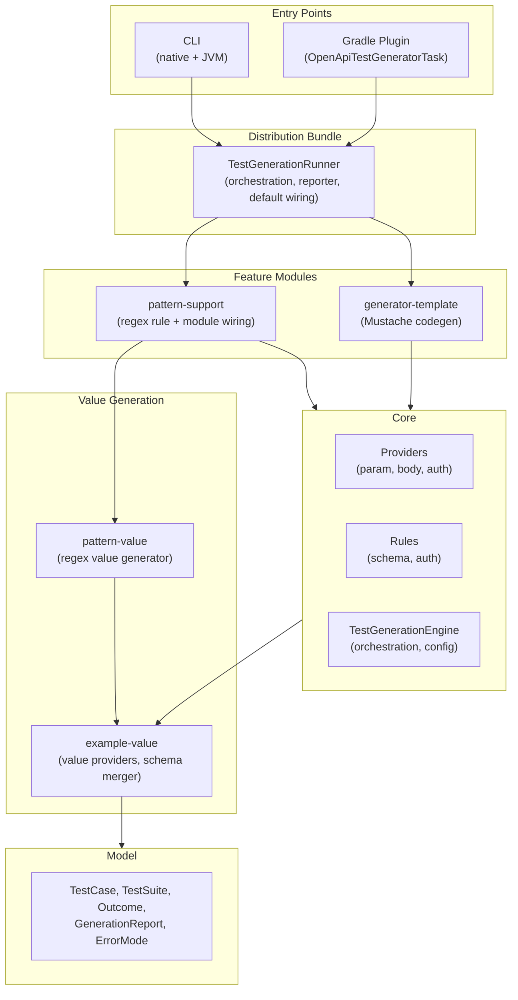
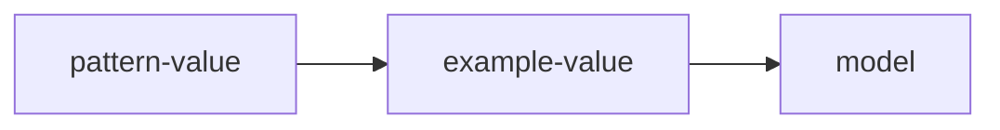

# Architecture

## System Overview

OpenAPI Test Generator is a Kotlin/JVM toolchain that turns OpenAPI specs into executable tests or test-suite artifacts. It targets:

- CLI users who want a fast generator for local runs or CI
- Gradle users who want generation wired into build pipelines
- Integrators who embed the core engine to customize rules, data providers, or generators

The design centers on a small, deterministic core that owns parsing, rule application, and test-suite assembly, with optional feature modules (template
generation, pattern-based values) injected explicitly by CLI/Gradle to avoid reflection-based discovery.

## What This Tool Tests

OpenAPI Test Generator validates **infrastructure-level behavior** - the contract compliance layer between API consumers and your controllers. This is distinct
from business logic testing.

### Infrastructure validation (what we test)

- **Parameter validation**: Type checking, format constraints (date, email, uuid), min/max bounds, enum membership, required vs optional
- **Request body validation**: JSON schema compliance, nested object structure, array limits, property constraints
- **Security enforcement**: Authentication presence, valid credentials format, correct security scheme usage

### Business logic (what we don't test)

- Data semantics (e.g., "order total must equal sum of line items")
- Authorization rules beyond API-level security (e.g., "users can only access their own orders")
- Side effects (e.g., "creating an order should send a confirmation email")
- State transitions (e.g., "orders can only be cancelled before shipping")

The generated tests verify that your API **rejects invalid requests** with appropriate error codes (400, 401, 403) - they don't verify what happens when valid
requests are processed.

## Related docs

- Documentation index: [docs home](../index.md)
- Getting started: [Getting started](../getting-started/index.md)
- How-to guides: [How-to](../how-to/index.md)
- Development: [development setup](../contributing/development-setup.md)
- Core module: [core](../modules/core.md)
- Reference:
    - [Distribution settings](../reference/distribution-settings.md)
    - [Rules catalog](../reference/catalogs/rules-catalog.md)
    - [Providers catalog](../reference/catalogs/providers-catalog.md)
    - [API reference](../reference/api.md)

## Module Dependency Graph

### Layered Architecture

### Value Provider Dependency Chain

The value generation stack follows a strict dependency direction:

**pattern-value** contains:

- `PatternValueProvider` (implements SchemaValueProvider SPI)
- `PatternValueGenerator` (regexp-gen wrapper)
- No core dependency

**example-value** contains:

- `SchemaValueProvider` SPI interface
- Built-in providers (enum, date, uuid, etc.)
- `SchemaMerger`, `CartesianProduct`

This layering enables standalone use of `pattern-value` for regex-based string generation without pulling in the test generation framework.

### Module Responsibilities

| Module                  | Responsibility                                  | Key Types                                                                   |
|-------------------------|-------------------------------------------------|-----------------------------------------------------------------------------|
| **build-logic**         | Convention plugins for centralized build config | `testgen.kotlin-base`, `testgen.quality`, `testgen.library`                 |
| **model**               | Data classes, error types                       | `TestCase`, `TestSuite`, `Outcome`, `GenerationError`                       |
| **example-value**       | Schema value generation SPI + builtins          | `SchemaValueProvider`, `SchemaExampleValueGenerator`, `SchemaMerger`        |
| **core**                | Parsing, generation, orchestration              | `TestGenerationEngine`, providers, rules, `TestSuiteWriter`                 |
| **pattern-value**       | Regex-based value generation                    | `PatternGenerationOptions`, `PatternValueGenerator`, `PatternValueProvider` |
| **pattern-support**     | Pattern integration module                      | `PatternSupportModule`, `PatternModuleSettingsExtractor`                    |
| **generator-template**  | Mustache-based code generation                  | `TemplateGeneratorModule`, `TemplateArtifactGenerator`                      |
| **distribution-bundle** | Bundles modules, execution wiring               | `TestGenerationRunner`, `TestGenerationReporter`, `DistributionDefaults`    |
| **plugin**              | Gradle build integration                        | `OpenApiTestGeneratorPlugin`, `OpenApiTestGeneratorTask`                    |
| **cli**                 | Command-line interface + native                 | `GenerateCommand`, Picocli wiring                                           |

## Data Flow

1. **Entry point**: CLI or Gradle creates a `TestGenerationRunner` (via `withDefaults()` or builder) with an environment-specific `TestGenerationReporter`.
2. **Configuration resolution**: `TestGenerationRunner.execute()` calls `TestGeneratorExecutionOptionsFactory.fromConfig` to merge overrides over YAML config
   and
   apply defaults.
3. **Parse OpenAPI**: `OpenApiSpecParser.parseOpenApi` loads and resolves the OpenAPI document with `ParseOptions().apply { isResolveFully = true }`.
4. **Build generation pipeline**: `TestGenerationEngine.createProcessor` wires schema merging, value providers, rules, and providers via
   `TestGeneratorConfigurer`.
5. **Generate suites per operation**:
    - `ValidCaseBuilder` constructs a baseline valid test case from operation parameters, request body, and security requirements.
    - `TestGenerationContext` wraps the valid case, OpenAPI model, and helper services (data providers, schema merger).
    - `ProviderOrchestrator` executes providers in fixed order (auth -> parameters -> request body).
    - Each provider applies rules to generate negative test cases expecting 400/401/403 status codes.
    - `OutcomeAggregator` collects provider results, merging test cases and errors.
    - `TestCaseBudgetValidator` enforces per-operation limits on generated test cases.
6. **Report outcomes**: `GenerationReport` captures successes, partials, and failures with `GenerationError` metadata. `TestGenerationRunner` formats and logs
   the report via its reporter.
7. **Emit artifacts**: `TestGenerationEngine.createArtifactGenerator` builds a generator by id (`test-suite-writer` or `template`) and writes files.
8. **Return result**: `TestGenerationRunner` returns `TestGenerationResult.Success` or `TestGenerationResult.Failure` for CLI/Gradle to handle appropriately.

## Core Abstractions

### Provider-Rule Architecture Pattern

- **Providers** implement `TestCaseProvider<T>` and operate on OpenAPI elements (operations,
  parameters, request bodies). They are orchestrated in a fixed order by `ProviderOrchestrator`.
- **Rules** encode constraints:
    - `SchemaValidationRule` produces `RuleValue` entries that providers turn into test cases.
    - `AuthValidationRule` produces complete `TestCase` objects for security scenarios.
- **Composition** for array/object schemas is handled through `ArrayItemSchemaValidationRule` and `ObjectItemSchemaValidationRule` using a `RuleContainer`.
- **Registry**: `ManualRuleRegistry` wires `BuiltInRules` plus any extra rules, ensuring deterministic ordering.

### Generator Extensibility Model

- **Artifact generators** are created through `ArtifactGeneratorFactory` and `ArtifactGeneratorRegistry` using generator ids (`GeneratorIds`).
- **Built-in** generators are registered explicitly by `BuiltInGenerators` (currently `test-suite-writer`).
- **Feature modules** implement `TestGenerationModule` to contribute:
    - `ArtifactGeneratorFactory` implementations
    - `SchemaValueProvider` instances (by id)
    - Additional `SimpleSchemaValidationRule` and `AuthValidationRule` rules
- CLI and Gradle pass modules explicitly (e.g., `TemplateGeneratorModule`, `PatternSupportModule`) to enable optional capabilities.

### Configuration Resolution Chain

- **Inputs**:
    - YAML config (`GeneratorConfig`) loaded by `GeneratorConfigLoader`.
    - Environment overrides from CLI args or Gradle DSL (`TestGeneratorOverrides`).
- **Merge**:
    - `TestGeneratorExecutionOptionsFactory` merges overrides over config (overrides win).
    - Module-specific settings are extracted via `ModuleSettingsExtractor` before core settings parsing.
    - `TestGenerationSettings` and `ExampleValueSettings` supply defaults when values are missing.
- **Defaults**:
    - CLI and Gradle insert the `pattern` example-value provider into the default provider order before `plain-string`.
- **Note**: The merge is deep for nested maps in `generatorOptions` and `testGenerationSettings`. Collections are replaced (not merged), and map/non-map
  mismatches prefer the override value (no fail-fast).

### Test Suite Generation Pipeline

This is an architecture-level summary of how the generator turns an OpenAPI operation into a `TestSuite` and artifacts.
For the canonical, step-by-step breakdown, see [Test generation flow](test-generation-flow.md).
See also [Budget controls](budget-controls.md) and the [TestCase reference](../reference/model/test-case.md) for output field semantics.

#### ValidCaseBuilder

Builds the baseline valid `TestCase` for each operation, used as the seed for generating negative cases.
See [Test generation flow](test-generation-flow.md).

#### Response Example Resolution

Resolves expected responses from explicit OpenAPI examples, with deterministic fallbacks when examples are missing.
See [TestCase reference](../reference/model/test-case.md) and [Module: `example-value`](../modules/example-value.md).

#### TestGenerationContext

Carries the OpenAPI model, operation, valid case, and shared helpers (schema merger, example value generator, budgets) through generation.
See [Test generation flow](test-generation-flow.md).

#### Provider Execution Order

Runs providers in a fixed order (auth → parameters → request body) and aggregates outcomes into a `TestSuite`.
See [Test generation flow](test-generation-flow.md) and [Provider-rule model](provider-rule-model.md).

#### Budget Controls

Budgets cap schema depth/combinations and maximum test cases per operation to keep generation tractable.
See [Budget controls](budget-controls.md).

### Schema Processing

#### SchemaMerger

Handles OpenAPI schema composition (allOf, anyOf, oneOf):

- Flattens composed schemas into a single merged schema for validation.
- Preserves constraint semantics (e.g., tightest bounds win for min/max).
- Tracks recursion depth via `SchemaMergerOptions.maxMergedSchemaDepth`.
- Works with `CombinationBudget` to limit cartesian explosion.

#### Cycle Detection

- `SchemaStructureHasher` computes structural hashes to detect schema cycles.
- `TestGenerationContext` implementations track `visitedSchemaRefs` and `visitedStructures` to prevent infinite loops.
- Cycle detection is deterministic and does not rely on object identity.

### Example Value Generation

Providers are tried in configured order until one produces a value:

1. **schema-example**: Uses OpenAPI `example` or `examples` from the schema.
2. **pattern** (pattern-support module): Generates values matching regex patterns.
3. **plain-string**: Falls back to basic type-appropriate values.

`ExampleValueSettings.providers` controls the order. `SchemaExampleValueGeneratorFactory` wires the configured providers into a `SchemaExampleValueGenerator`.

## Module Deep-Dives

Per-module responsibilities and entry points are documented under [Modules](../modules/index.md).
Start there for the authoritative "what lives where" view, then jump into the module page for the area you're working on.

Common starting points:

- [core](../modules/core.md)
- [distribution-bundle](../modules/distribution-bundle.md)
- [plugin](../modules/plugin.md)
- [cli](../modules/cli.md)
- [example-value](../modules/example-value.md)
- [pattern-support](../modules/pattern-support.md)

## Cross-Cutting Concerns

### Ignore Configuration

Test case and rule filtering is controlled via `TestGenerationSettings`:

- **ignoreTestCases**: Map of exact paths to operation/test case filters. Supports wildcard path (`*`) and wildcard method (`*`); test case names are exact
  matches.
- **ignoreSchemaValidationRules**: Set of rule names to skip (e.g., `"OutOfMinimumLengthString"`).
- **ignoreAuthValidationRules**: Set of auth rule names to skip.

`IgnoreConfigHandler` applies filters during generation:

1. Path matching: Filters operations by exact path or wildcard path.
2. Method matching: Filters by HTTP method within matched paths (case-insensitive; wildcard supported).
3. Test case matching: Filters individual test cases by exact name.

Filtering is applied deterministically after test case generation to ensure stable output.

### GraalVM / Native Image Compatibility

- CLI uses the GraalVM Native Build Tools plugin (`:cli:nativeCompile`).
- Rule and generator wiring is explicit (`BuiltInRules`, `BuiltInGenerators`, `TestGenerationModule`), avoiding reflection for discovery.
- Reflection still exists in specific areas: the template generator uses Mustache's `ReflectionObjectHandler`, and the Gradle plugin uses Kotlin reflection to
  copy settings.
- The OpenAPI parser and Jackson can require reflection configuration for native images (see CLI documentation for agent-based config generation).

### Determinism Guarantees

- Rules and generators are registered and sorted deterministically (`BuiltInRules`, `ManualRuleRegistry`, `BuiltInGenerators`).
- `TestGenerationEngine` validates and sorts modules by id to ensure stable ordering.
- `ExampleValueSettings.providers` defines provider precedence; missing providers are logged, and fallback ordering is deterministic.
- `TestSuiteWriter` sorts suite keys and test cases during merge to stabilize output.

### Error Handling Philosophy

- **Errors as values**: Most domain errors are captured as values, not thrown exceptions.
- **Outcome type hierarchy**:
    - `Outcome.Success<T>`: Operation completed with result.
    - `Outcome.PartialSuccess<T>`: Operation produced results but also encountered errors.
    - `Outcome.Failure`: Operation failed entirely with error list.
- **Error aggregation**: `OutcomeAggregator` merges provider results, accumulating test cases and
  errors. Final `Outcome` type depends on whether any test cases were produced.
- **Error boundary**: `runProviderSafely` wraps provider execution, converting uncaught exceptions to `Outcome.Failure` with meaningful context.
- **Error modes**: `ErrorHandlingConfig` controls behavior:
    - `ErrorMode.FAIL_FAST`: Stop on first error.
    - `ErrorMode.COLLECT_ALL`: Accumulate errors up to `maxErrors` limit (default 100).
- **Budget violations**: `BudgetExceededException` from provider logic (schema combinations/depth) is converted to `GenerationError` at provider boundaries.
  `TestCaseBudgetValidator` exceptions currently propagate unless caught by the caller.
- **Error context**: Every `GenerationError` includes `ErrorContext` with operation path, method, operationId, and optionally field/rule name for precise error
  location.
